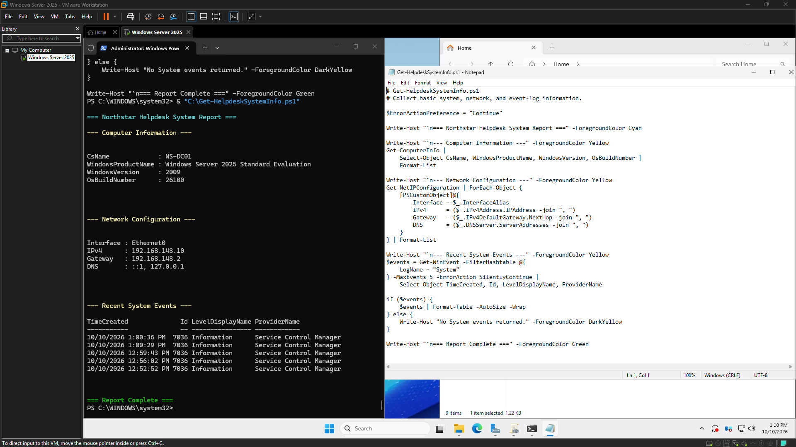
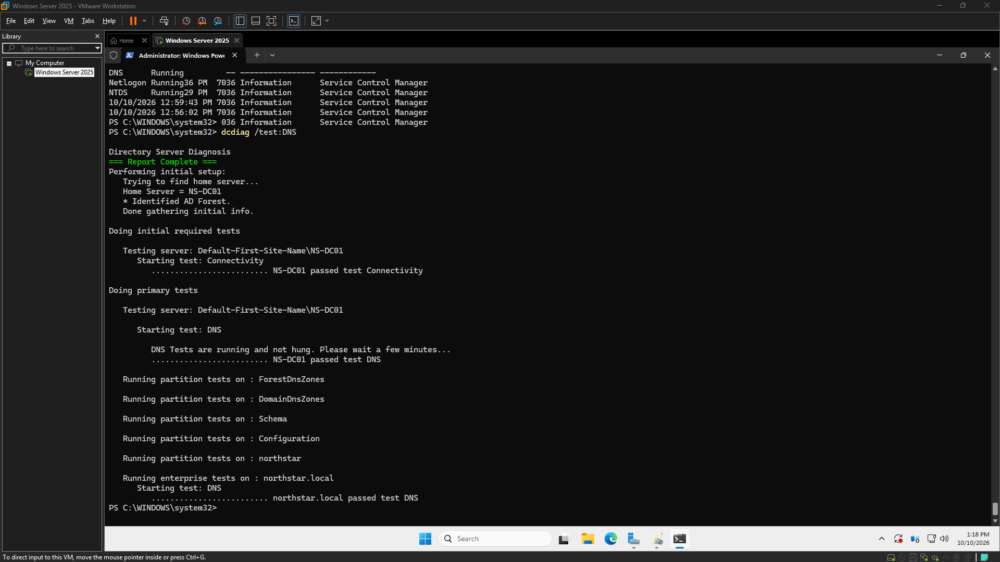

# Windows-Helpdesk-Lab

Status: Complete

## Project story
Windows-Helpdesk-Lab v1.0 is complete as a documented small-business Windows domain lab. It establishes the Northstar server, Active Directory, and DNS foundation; records directory and service checks; and includes a reusable PowerShell system-information report. The Northstar Workstation Policy is configured and linked, but application on a domain-joined workstation was not verified.

## Completion boundary
The project owner confirmed v1.0 complete. The delivered scope includes the lab foundation, administration checks, and configured/linked policy. Client-side GPO application remains unverified. Account-access, DNS/connectivity, and Group Policy behavior tickets remain proposed future portfolio exercises, not completed incidents.

## Project timeline
### 2026-10-10 • 09:17 to 10:02
- Goal
Build and validate the remaining Windows Helpdesk Lab MVP components, prioritizing Group Policy, PowerShell troubleshooting, and a practical helpdesk scenario.

- Definition of Done
Complete one verified administration or troubleshooting task, create a useful PowerShell artifact, capture evidence, and record outstanding work for Session 2.

- Goal Achieved
✅ Yes

Summary:
This session focused on practical Windows Server administration, encompassing Group Policy configuration, PowerShell-based system diagnostics, and the development of reusable tooling within a simulated corporate IT environment. Key deliverables included configuring and linking the workstation policy (with client application still unverified), specific account configuration, system health checks using PowerShell, and evidence-driven documentation.

Tasks Completed:
1.  Created and linked the 'Northstar Workstation Policy' Group Policy Object (GPO) to the 'Northstar Computers' Organizational Unit (OU).
2.  Configured the 'Northstar Workstation Policy' GPO to rename the local guest account with the value 'DisabledGuest'.
3.  Executed PowerShell diagnostics on the NS-DC01 domain controller to inspect operating system information, network configuration, and recent System events.
4.  Developed and executed the reusable 'Get-HelpdeskSystemInfo.ps1' PowerShell utility for standardized system information retrieval.
5.  Captured comprehensive screenshots documenting the GPO configuration, PowerShell diagnostics output, and the implementation/execution of the custom script for verification.

Issues Encountered:
*   Initial navigation challenges within Group Policy Management, specifically locating the appropriate security setting for account renaming.

Next Steps:
None explicitly defined for this session.

Notes:
This session emphasized focused execution, accurate verification, and the completion of meaningful work within a short timeframe. The work highlighted practical skills in Group Policy configuration and PowerShell-based troubleshooting, alongside the importance of reusable tooling and evidence-driven documentation.

- Working Story
Practical Windows Server administration, Group Policy configuration, PowerShell-based troubleshooting, reusable tooling, evidence-driven documentation in a simulated corporate IT environment, Emphasize focused execution, accurate verification, completing meaningful work in short sessions

- Friction and AI Gaps
Navigating Group Policy Management and locating the appropriate security setting.

- What the AI Missed
None

- AI Peer Review
Status: Approved
Reviewer: human
Reviewed At: 2026-10-10 10:04:32
Reviewer Notes: Session objectives achieved. The GPO was configured, PowerShell diagnostics were executed, the reusable script was created and run, and the corresponding evidence was captured. GPO application to a domain-joined workstation has not yet been verified.

- Duration
45 minutes (Planned: 90 minutes)

- Notes
Project: Windows-HelpDesk-Lab, Domain controller: NS-DC01, OS: Windows Server 2025, Domain: northstar.local, GPO: Northstar Workstation Policy, Script: Get-HelpdeskSystemInfo.ps1, AutoDoc GitHub integration: deferred; manual Git synchronization remains available

## Screenshot captured at 2026-10-10_131044

## Screenshot – Final DNS health check

---

## Session – 12:27 to 13:18
- Goal
Complete the Windows Helpdesk Lab v1.0 by verifying existing deliverables, reviewing documentation and screenshots, confirming repository contents, and publishing the final intended changes to GitHub.

- Definition of Done
The PowerShell script is present and tested, Active Directory and DNS are verified, the GPO configuration is accurately documented, the README and evidence are presentable, intended changes are committed and pushed, the final Git working tree is clean.

- Goal Achieved
✅ Yes

Summary:
This work focused on validating the health and configuration of a Windows Server helpdesk lab environment, specifically verifying Active Directory DNS and security-group configurations. Key achievements include improving reusable PowerShell troubleshooting output, capturing comprehensive evidence of script execution and domain-controller health using an automated workflow, and maintaining repository hygiene while preserving local session state. A deliberate scope decision was made to defer workstation-level GPO validation to a later stage.

Tasks Completed:
*   Verified Active Directory and DNS health on NS-DC01.
*   Confirmed NTDS DNS and Netlogon services are running on NS-DC01.
*   Verified DNS diagnostics using `dcdiag`.
*   Validated 'Employees Helpdesk' and 'IT-Admins' group memberships.
*   Confirmed the 'Northstar Workstation Policy' exists and is correctly linked to the 'Northstar Computers OU'.
*   Reviewed and improved the reusable `Get-HelpdeskSystemInfo.ps1` PowerShell script.
*   Executed the updated reporting script inside NS-DC01.
*   Captured updated script execution and final DNS health-check evidence using the AutoDoc screenshot-workflow.
*   Added a root `.gitignore` file to exclude local AutoDoc session state and virtual-environment files.
*   Committed script improvements and ignore rules (commit `89d8393`).

Issues Encountered:
*   Difficulty distinguishing host PC files from files residing inside the VMware guest VM, leading to confusion about which PowerShell script version was being executed.
*   Challenges in reviewing Git changes without inadvertently committing temporary AutoDoc state files.
*   AI initially confused host and guest VM paths, requiring manual clarification.
*   AI incorrectly treated updated host scripts and VM scripts as identical without content verification.
*   AI recommended manual documentation edits despite an existing AutoDoc finish workflow being in place.
*   Spent unnecessary time investigating a separate workstation VM as AI initially pushed for it, before agreeing to defer workstation-level GPO validation.

Next Steps:
*   Perform workstation-level GPO validation (deferred from current scope).

Notes:
*   The decision to defer workstation-level GPO validation was made to maintain the MVP scope and avoid expansion at this stage.
*   Improved practices are needed for managing and verifying script versions across host and guest environments to prevent execution of outdated or incorrect files.
*   Git hygiene, especially regarding temporary files generated by tools like AutoDoc, requires careful `.gitignore` management to maintain a clean repository while preserving local session states.
*   When interacting with AI, it's crucial to clearly define the existing tools, workflows, and scope to prevent misdirection or recommendations that conflict with established processes.

- Working Story
Validated a functional Windows Server helpdesk lab, verified Active Directory DNS and security-group configuration, improved reusable PowerShell troubleshooting output, captured evidence of script execution and domain-controller health, maintained repository hygiene while preserving AutoDoc's local session state, made a deliberate scope decision to defer workstation-level GPO validation

- Friction and AI Gaps
Distinguishing host PC files from files inside the VMware guest, determining which copy of the PowerShell script was being executed, reviewing Git changes without committing temporary AutoDoc state, deciding to defer workstation-level GPO validation to avoid expanding the MVP scope

- What the AI Missed
Initially confused host and guest VM paths, treated the updated host script and the VM script as though they were identical before verifying their contents, recommended manual documentation edits despite the existing AutoDoc finish workflow, spent unnecessary time checking for a separate workstation VM before agreeing to defer that requirement

- AI Peer Review
Status: Approved
Reviewer: human
Reviewed At: 2026-10-10 13:19:56
Reviewer Notes: Core lab checks passed, PowerShell reporting script executed successfully inside NS-DC01, screenshots captured through AutoDoc, workstation-level GPO application remains unverified, existing commit 89d8393 is local and has not yet been pushed, review final Git changes and verify repository contents before requesting push approval

- Duration
51 minutes (Planned: 30 minutes)

- Notes
Domain northstar.local, domain controller NS-DC01, Windows Server 2025, VMware Workstation Pro, AutoDoc GitHub integration deferred in favor of manual Git synchronization
### 2026-10-05 • 05:06 to 05:24
- Goal
Build the initial Northstar Solutions Active Directory structure, including organizational units, users, and security groups.

- Definition of Done
OUs, test users, and security groups are created and organized in northstar.local.

- Goal Achieved
✅ Yes

Summary:
This initial phase focused on establishing a foundational Active Directory environment for Northstar Solutions, simulating a corporate setup. The primary objective was to practically demonstrate core Windows Server and Active Directory administration tasks, ensuring documented evidence of the directory structure, account management, and security group organization.

Tasks Completed:
*   Built the initial Northstar Solutions Active Directory organizational structure.
*   Created test users and security groups within the new structure.
*   Configured group membership for the created test users.
*   Practiced user password administration, including setting and resetting passwords.

Issues Encountered:
None

Next Steps:
Consolidate and present the documented evidence of the established directory structure, account management, and security group organization to fulfill the demonstration objectives.

Notes:
None

- Working Story
Demonstrate practical Windows Server and Active Directory administration in a simulated corporate environment, with documented evidence of directory structure, account management, and security group organization.

- Friction and AI Gaps
None

- What the AI Missed
None

- AI Peer Review
Status: Approved
Reviewer: human
Reviewed At: 2026-10-05 05:25:48
Reviewer Notes: 

- Duration
18 minutes (Planned: 30 minutes)

- Notes
### 2026-09-28 • 15:38 to 16:46
- Goal
Create and install the Windows Server 2022 virtual machine for the Northstar Solutions Help Desk Lab

- Definition of Done
Windows Server 2022 is installed, boots successfully, and the server is ready for initial configuration.

- Goal Achieved
✅ Yes

Summary:
The initial infrastructure for the Northstar Solutions Windows Server environment has been successfully deployed. This foundational work involved building the core domain controller and establishing essential network services, laying the groundwork for future administrative tasks and help-desk training scenarios.

Tasks Completed:
*   Deployed the initial Northstar Solutions Windows Server environment.
*   Configured NS-DC01 as the primary domain controller.
*   Established the foundational network infrastructure.
*   Installed and configured Active Directory Domain Services (AD DS).
*   Installed and configured DNS services.
*   Verified the operational status of the domain controller.

Issues Encountered:
*   Experienced extended loading times during the installation process of the Windows Server environment.

Next Steps:
*   Begin documentation of the current server configuration and network topology.
*   Prepare for the deployment of additional server roles and client machines to support future help-desk scenarios.

Notes:
This phase represents a critical step in building a robust Windows administration environment from the ground up, establishing the core infrastructure that will support all subsequent deployments and provide a realistic platform for help-desk training.

- Working Story
Building a Windows administration environment from the ground up and establishing the infrastructure foundation for future help-desk scenarios.

- Friction and AI Gaps
Installation loading times

- What the AI Missed
None

- AI Peer Review
Status: Approved
Reviewer: human
Reviewed At: 2026-09-28 16:47:43
Reviewer Notes: 

- Duration
67 minutes (Planned: 90 minutes)

- Notes
### 2026-09-23 • 01:28 to 01:35
- Goal
Prepare Windows Server Installation

- Definition of Done
N/A

- Goal Achieved
✅ Yes

Summary:
The Windows Server operating system was successfully installed from an ISO image.

Tasks Completed:
- Installed Windows Server ISO.

Issues Encountered:
None.

Next Steps:
Proceed with initial post-installation server configuration and validation.

Notes:
No additional notes.

- Working Story
None

- Friction and AI Gaps
None

- What the AI Missed
None

- AI Peer Review
Status: Approved
Reviewer: human
Reviewed At: 2026-09-23 01:35:50
Reviewer Notes: 

- Duration
6 minutes (Planned: 5 minutes)

- Notes

## Screenshots and proof
### Highlight: Powershell Helpdesk System Info Script Execution

This screenshot captures the live shell output or diagnostic evidence that is guiding the current troubleshooting, validation, or operational decision. It highlights the key detail the viewer should notice in this stage of the project.
### Highlight: Ns Dc01 Powershell System Troubleshooting

This screenshot captures the live shell output or diagnostic evidence that is guiding the current troubleshooting, validation, or operational decision. It highlights the key detail the viewer should notice in this stage of the project.
### Highlight: Northstar Workstation Policy Configured

This screenshot shows the current configuration or system state being reviewed as part of the active project setup, validation, or troubleshooting work. It highlights the key detail the viewer should notice in this stage of the project.

## Trials and tribulations
### 2026-10-10 • 09:17 to 10:02
### Goal
Build and validate the remaining Windows Helpdesk Lab MVP components, prioritizing Group Policy, PowerShell troubleshooting, and a practical helpdesk scenario.

### Definition of Done
Complete one verified administration or troubleshooting task, create a useful PowerShell artifact, capture evidence, and record outstanding work for Session 2.

### Goal Achieved
✅ Yes

Summary:
This session focused on practical Windows Server administration, encompassing Group Policy configuration, PowerShell-based system diagnostics, and the development of reusable tooling within a simulated corporate IT environment. Key deliverables included configuring and linking the workstation policy (with client application still unverified), specific account configuration, system health checks using PowerShell, and evidence-driven documentation.

Tasks Completed:
1.  Created and linked the 'Northstar Workstation Policy' Group Policy Object (GPO) to the 'Northstar Computers' Organizational Unit (OU).
2.  Configured the 'Northstar Workstation Policy' GPO to rename the local guest account with the value 'DisabledGuest'.
3.  Executed PowerShell diagnostics on the NS-DC01 domain controller to inspect operating system information, network configuration, and recent System events.
4.  Developed and executed the reusable 'Get-HelpdeskSystemInfo.ps1' PowerShell utility for standardized system information retrieval.
5.  Captured comprehensive screenshots documenting the GPO configuration, PowerShell diagnostics output, and the implementation/execution of the custom script for verification.

Issues Encountered:
*   Initial navigation challenges within Group Policy Management, specifically locating the appropriate security setting for account renaming.

Next Steps:
None explicitly defined for this session.

Notes:
This session emphasized focused execution, accurate verification, and the completion of meaningful work within a short timeframe. The work highlighted practical skills in Group Policy configuration and PowerShell-based troubleshooting, alongside the importance of reusable tooling and evidence-driven documentation.

### Working Story
Practical Windows Server administration, Group Policy configuration, PowerShell-based troubleshooting, reusable tooling, evidence-driven documentation in a simulated corporate IT environment, Emphasize focused execution, accurate verification, completing meaningful work in short sessions

### Friction and AI Gaps
Navigating Group Policy Management and locating the appropriate security setting.

### What the AI Missed
None

### AI Peer Review
Status: Approved
Reviewer: human
Reviewed At: 2026-10-10 10:04:32
Reviewer Notes: Session objectives achieved. The GPO was configured, PowerShell diagnostics were executed, the reusable script was created and run, and the corresponding evidence was captured. GPO application to a domain-joined workstation has not yet been verified.

### Duration
45 minutes (Planned: 90 minutes)

### Notes
Project: Windows-HelpDesk-Lab, Domain controller: NS-DC01, OS: Windows Server 2025, Domain: northstar.local, GPO: Northstar Workstation Policy, Script: Get-HelpdeskSystemInfo.ps1, AutoDoc GitHub integration: deferred; manual Git synchronization remains available

## Screenshot captured at 2026-10-10_131044

## Screenshot – Final DNS health check

---

## Session – 12:27 to 13:18
### Goal
Complete the Windows Helpdesk Lab v1.0 by verifying existing deliverables, reviewing documentation and screenshots, confirming repository contents, and publishing the final intended changes to GitHub.

### Definition of Done
The PowerShell script is present and tested, Active Directory and DNS are verified, the GPO configuration is accurately documented, the README and evidence are presentable, intended changes are committed and pushed, the final Git working tree is clean.

### Goal Achieved
✅ Yes

Summary:
This work focused on validating the health and configuration of a Windows Server helpdesk lab environment, specifically verifying Active Directory DNS and security-group configurations. Key achievements include improving reusable PowerShell troubleshooting output, capturing comprehensive evidence of script execution and domain-controller health using an automated workflow, and maintaining repository hygiene while preserving local session state. A deliberate scope decision was made to defer workstation-level GPO validation to a later stage.

Tasks Completed:
*   Verified Active Directory and DNS health on NS-DC01.
*   Confirmed NTDS DNS and Netlogon services are running on NS-DC01.
*   Verified DNS diagnostics using `dcdiag`.
*   Validated 'Employees Helpdesk' and 'IT-Admins' group memberships.
*   Confirmed the 'Northstar Workstation Policy' exists and is correctly linked to the 'Northstar Computers OU'.
*   Reviewed and improved the reusable `Get-HelpdeskSystemInfo.ps1` PowerShell script.
*   Executed the updated reporting script inside NS-DC01.
*   Captured updated script execution and final DNS health-check evidence using the AutoDoc screenshot-workflow.
*   Added a root `.gitignore` file to exclude local AutoDoc session state and virtual-environment files.
*   Committed script improvements and ignore rules (commit `89d8393`).

Issues Encountered:
*   Difficulty distinguishing host PC files from files residing inside the VMware guest VM, leading to confusion about which PowerShell script version was being executed.
*   Challenges in reviewing Git changes without inadvertently committing temporary AutoDoc state files.
*   AI initially confused host and guest VM paths, requiring manual clarification.
*   AI incorrectly treated updated host scripts and VM scripts as identical without content verification.
*   AI recommended manual documentation edits despite an existing AutoDoc finish workflow being in place.
*   Spent unnecessary time investigating a separate workstation VM as AI initially pushed for it, before agreeing to defer workstation-level GPO validation.

Next Steps:
*   Perform workstation-level GPO validation (deferred from current scope).

Notes:
*   The decision to defer workstation-level GPO validation was made to maintain the MVP scope and avoid expansion at this stage.
*   Improved practices are needed for managing and verifying script versions across host and guest environments to prevent execution of outdated or incorrect files.
*   Git hygiene, especially regarding temporary files generated by tools like AutoDoc, requires careful `.gitignore` management to maintain a clean repository while preserving local session states.
*   When interacting with AI, it's crucial to clearly define the existing tools, workflows, and scope to prevent misdirection or recommendations that conflict with established processes.

### Working Story
Validated a functional Windows Server helpdesk lab, verified Active Directory DNS and security-group configuration, improved reusable PowerShell troubleshooting output, captured evidence of script execution and domain-controller health, maintained repository hygiene while preserving AutoDoc's local session state, made a deliberate scope decision to defer workstation-level GPO validation

### Friction and AI Gaps
Distinguishing host PC files from files inside the VMware guest, determining which copy of the PowerShell script was being executed, reviewing Git changes without committing temporary AutoDoc state, deciding to defer workstation-level GPO validation to avoid expanding the MVP scope

### What the AI Missed
Initially confused host and guest VM paths, treated the updated host script and the VM script as though they were identical before verifying their contents, recommended manual documentation edits despite the existing AutoDoc finish workflow, spent unnecessary time checking for a separate workstation VM before agreeing to defer that requirement

### AI Peer Review
Status: Approved
Reviewer: human
Reviewed At: 2026-10-10 13:19:56
Reviewer Notes: Core lab checks passed, PowerShell reporting script executed successfully inside NS-DC01, screenshots captured through AutoDoc, workstation-level GPO application remains unverified, existing commit 89d8393 is local and has not yet been pushed, review final Git changes and verify repository contents before requesting push approval

### Duration
51 minutes (Planned: 30 minutes)

### Notes
Domain northstar.local, domain controller NS-DC01, Windows Server 2025, VMware Workstation Pro, AutoDoc GitHub integration deferred in favor of manual Git synchronization
### 2026-10-05 • 05:06 to 05:24
### Goal
Build the initial Northstar Solutions Active Directory structure, including organizational units, users, and security groups.

### Definition of Done
OUs, test users, and security groups are created and organized in northstar.local.

### Goal Achieved
✅ Yes

Summary:
This initial phase focused on establishing a foundational Active Directory environment for Northstar Solutions, simulating a corporate setup. The primary objective was to practically demonstrate core Windows Server and Active Directory administration tasks, ensuring documented evidence of the directory structure, account management, and security group organization.

Tasks Completed:
*   Built the initial Northstar Solutions Active Directory organizational structure.
*   Created test users and security groups within the new structure.
*   Configured group membership for the created test users.
*   Practiced user password administration, including setting and resetting passwords.

Issues Encountered:
None

Next Steps:
Consolidate and present the documented evidence of the established directory structure, account management, and security group organization to fulfill the demonstration objectives.

Notes:
None

### Working Story
Demonstrate practical Windows Server and Active Directory administration in a simulated corporate environment, with documented evidence of directory structure, account management, and security group organization.

### Friction and AI Gaps
None

### What the AI Missed
None

### AI Peer Review
Status: Approved
Reviewer: human
Reviewed At: 2026-10-05 05:25:48
Reviewer Notes: 

### Duration
18 minutes (Planned: 30 minutes)

### Notes
### 2026-09-28 • 15:38 to 16:46
### Goal
Create and install the Windows Server 2022 virtual machine for the Northstar Solutions Help Desk Lab

### Definition of Done
Windows Server 2022 is installed, boots successfully, and the server is ready for initial configuration.

### Goal Achieved
✅ Yes

Summary:
The initial infrastructure for the Northstar Solutions Windows Server environment has been successfully deployed. This foundational work involved building the core domain controller and establishing essential network services, laying the groundwork for future administrative tasks and help-desk training scenarios.

Tasks Completed:
*   Deployed the initial Northstar Solutions Windows Server environment.
*   Configured NS-DC01 as the primary domain controller.
*   Established the foundational network infrastructure.
*   Installed and configured Active Directory Domain Services (AD DS).
*   Installed and configured DNS services.
*   Verified the operational status of the domain controller.

Issues Encountered:
*   Experienced extended loading times during the installation process of the Windows Server environment.

Next Steps:
*   Begin documentation of the current server configuration and network topology.
*   Prepare for the deployment of additional server roles and client machines to support future help-desk scenarios.

Notes:
This phase represents a critical step in building a robust Windows administration environment from the ground up, establishing the core infrastructure that will support all subsequent deployments and provide a realistic platform for help-desk training.

### Working Story
Building a Windows administration environment from the ground up and establishing the infrastructure foundation for future help-desk scenarios.

### Friction and AI Gaps
Installation loading times

### What the AI Missed
None

### AI Peer Review
Status: Approved
Reviewer: human
Reviewed At: 2026-09-28 16:47:43
Reviewer Notes: 

### Duration
67 minutes (Planned: 90 minutes)

### Notes
### 2026-09-23 • 01:28 to 01:35
### Goal
Prepare Windows Server Installation

### Definition of Done
N/A

### Goal Achieved
✅ Yes

Summary:
The Windows Server operating system was successfully installed from an ISO image.

Tasks Completed:
- Installed Windows Server ISO.

Issues Encountered:
None.

Next Steps:
Proceed with initial post-installation server configuration and validation.

Notes:
No additional notes.

### Working Story
None

### Friction and AI Gaps
None

### What the AI Missed
None

### AI Peer Review
Status: Approved
Reviewer: human
Reviewed At: 2026-09-23 01:35:50
Reviewer Notes: 

### Duration
6 minutes (Planned: 5 minutes)

### Notes

## Lessons learned
- Keep documentation close to delivery.
- Use screenshots as proof points.
- Write the story in plain language for future employers and collaborators.

## Next steps
- Share the completed project summary in the README and release notes.
- Capture any final cleanup or deployment follow-up items.
- Keep logs fresh for future review and hiring conversations.

---

# Windows-Helpdesk-Lab

Status: In progress

## Project story
This concise summary outlines the ongoing development of the 'Windows-Helpdesk-Lab' project, a practical environment for technical skill development.

---

### 1. Project story
The `Windows-Helpdesk-Lab` project is establishing a simulated corporate IT environment designed to refine practical Windows Server administration, Group Policy management, and PowerShell-based troubleshooting skills. Current work focuses on building out foundational Active Directory and DNS services, implementing security policies through Group Policy Objects (GPOs), and developing reusable PowerShell scripts to streamline common helpdesk operations. This ongoing effort emphasizes a well-documented, verifiable, and hands-on approach to modern IT infrastructure management.

### 2. Key achievements
*   **Core Infrastructure Establishment:** Configured a Windows Server 2025 domain controller (`NS-DC01`) for the `northstar.local` domain, including static IP assignment and foundational Active Directory and DNS services.
*   **Group Policy Implementation:** Designed and deployed the 'Northstar Workstation Policy' GPO, linking it to the 'Northstar Computers' Organizational Unit (OU) and configuring a key security setting to rename the local guest account to 'DisabledGuest'.
*   **PowerShell Tooling Development:** Created and iteratively refined `Get-HelpdeskSystemInfo.ps1`, a reusable PowerShell script for standardized system information retrieval and diagnostics, integrated for efficient troubleshooting within the lab.
*   **System Health & Security Validation:** Performed comprehensive health checks of Active Directory, DNS, and critical services (`NTDS`, `Netlogon`) using `dcdiag` and PowerShell, alongside validating 'Employees Helpdesk' and 'IT-Admins' group memberships.
*   **Documentation & Repository Management:** Leveraged an automated screenshot workflow for evidence capture and established repository hygiene with a `.gitignore` file to manage local session state.

### 3. Lessons learned
*   **Interface Navigation Proficiency:** Initial friction encountered in navigating complex administrative interfaces like Group Policy Management underscored the value of deep familiarity for efficient configuration.
*   **Value of Reusable Automation:** Developing and iterating on PowerShell scripts significantly enhances the efficiency and consistency of system diagnostics and information retrieval.
*   **Scoped Execution:** Focused, time-boxed sessions with clear definitions of done prove effective in achieving measurable progress, allowing for strategic deferral of certain validations to optimize immediate goals.
*   **Multi-Layered Verification:** Emphasizing verification of configurations (e.g., GPO creation and linking) independent of their end-user application is crucial for building robust and reliable systems.

### 4. Next steps
*   Verify the application and impact of the 'Northstar Workstation Policy' GPO on domain-joined workstations.
*   Continue to expand and refine helpdesk-oriented PowerShell scripts and automation within the lab environment.
*   Further integrate and automate documentation processes for continuous project transparency.

### 5. Proof points
*   `Northstar Workstation Policy Configured`
*   `NS-DC01 Powershell System Troubleshooting`
*   `Powershell HelpDesk System Info Script & Execution`
*   `Final DNS health check`
*   `ad-structure-users-and-groups`
*   `Windows Server 2025 Installation Progress on NS-DC01`
*   `NS-DC01 static IP configured`

## Project timeline
### 2026-10-10 • 09:17 to 10:02
- Goal
Build and validate the remaining Windows Helpdesk Lab MVP components, prioritizing Group Policy, PowerShell troubleshooting, and a practical helpdesk scenario.

- Definition of Done
Complete one verified administration or troubleshooting task, create a useful PowerShell artifact, capture evidence, and record outstanding work for Session 2.

- Goal Achieved
✅ Yes

Summary:
This session focused on practical Windows Server administration, encompassing Group Policy configuration, PowerShell-based system diagnostics, and the development of reusable tooling within a simulated corporate IT environment. Key deliverables included configuring and linking the workstation policy (with client application still unverified), specific account configuration, system health checks using PowerShell, and evidence-driven documentation.

Tasks Completed:
1.  Created and linked the 'Northstar Workstation Policy' Group Policy Object (GPO) to the 'Northstar Computers' Organizational Unit (OU).
2.  Configured the 'Northstar Workstation Policy' GPO to rename the local guest account with the value 'DisabledGuest'.
3.  Executed PowerShell diagnostics on the NS-DC01 domain controller to inspect operating system information, network configuration, and recent System events.
4.  Developed and executed the reusable 'Get-HelpdeskSystemInfo.ps1' PowerShell utility for standardized system information retrieval.
5.  Captured comprehensive screenshots documenting the GPO configuration, PowerShell diagnostics output, and the implementation/execution of the custom script for verification.

Issues Encountered:
*   Initial navigation challenges within Group Policy Management, specifically locating the appropriate security setting for account renaming.

Next Steps:
None explicitly defined for this session.

Notes:
This session emphasized focused execution, accurate verification, and the completion of meaningful work within a short timeframe. The work highlighted practical skills in Group Policy configuration and PowerShell-based troubleshooting, alongside the importance of reusable tooling and evidence-driven documentation.

- Working Story
Practical Windows Server administration, Group Policy configuration, PowerShell-based troubleshooting, reusable tooling, evidence-driven documentation in a simulated corporate IT environment, Emphasize focused execution, accurate verification, completing meaningful work in short sessions

- Friction and AI Gaps
Navigating Group Policy Management and locating the appropriate security setting.

- What the AI Missed
None

- AI Peer Review
Status: Approved
Reviewer: human
Reviewed At: 2026-10-10 10:04:32
Reviewer Notes: Session objectives achieved. The GPO was configured, PowerShell diagnostics were executed, the reusable script was created and run, and the corresponding evidence was captured. GPO application to a domain-joined workstation has not yet been verified.

- Duration
45 minutes (Planned: 90 minutes)

- Notes
Project: Windows-HelpDesk-Lab, Domain controller: NS-DC01, OS: Windows Server 2025, Domain: northstar.local, GPO: Northstar Workstation Policy, Script: Get-HelpdeskSystemInfo.ps1, AutoDoc GitHub integration: deferred; manual Git synchronization remains available

## Screenshot captured at 2026-10-10_131044

## Screenshot – Final DNS health check

---

## Session – 12:27 to 13:18
- Goal
Complete the Windows Helpdesk Lab v1.0 by verifying existing deliverables, reviewing documentation and screenshots, confirming repository contents, and publishing the final intended changes to GitHub.

- Definition of Done
The PowerShell script is present and tested, Active Directory and DNS are verified, the GPO configuration is accurately documented, the README and evidence are presentable, intended changes are committed and pushed, the final Git working tree is clean.

- Goal Achieved
✅ Yes

Summary:
This work focused on validating the health and configuration of a Windows Server helpdesk lab environment, specifically verifying Active Directory DNS and security-group configurations. Key achievements include improving reusable PowerShell troubleshooting output, capturing comprehensive evidence of script execution and domain-controller health using an automated workflow, and maintaining repository hygiene while preserving local session state. A deliberate scope decision was made to defer workstation-level GPO validation to a later stage.

Tasks Completed:
*   Verified Active Directory and DNS health on NS-DC01.
*   Confirmed NTDS DNS and Netlogon services are running on NS-DC01.
*   Verified DNS diagnostics using `dcdiag`.
*   Validated 'Employees Helpdesk' and 'IT-Admins' group memberships.
*   Confirmed the 'Northstar Workstation Policy' exists and is correctly linked to the 'Northstar Computers OU'.
*   Reviewed and improved the reusable `Get-HelpdeskSystemInfo.ps1` PowerShell script.
*   Executed the updated reporting script inside NS-DC01.
*   Captured updated script execution and final DNS health-check evidence using the AutoDoc screenshot-workflow.
*   Added a root `.gitignore` file to exclude local AutoDoc session state and virtual-environment files.
*   Committed script improvements and ignore rules (commit `89d8393`).

Issues Encountered:
*   Difficulty distinguishing host PC files from files residing inside the VMware guest VM, leading to confusion about which PowerShell script version was being executed.
*   Challenges in reviewing Git changes without inadvertently committing temporary AutoDoc state files.
*   AI initially confused host and guest VM paths, requiring manual clarification.
*   AI incorrectly treated updated host scripts and VM scripts as identical without content verification.
*   AI recommended manual documentation edits despite an existing AutoDoc finish workflow being in place.
*   Spent unnecessary time investigating a separate workstation VM as AI initially pushed for it, before agreeing to defer workstation-level GPO validation.

Next Steps:
*   Perform workstation-level GPO validation (deferred from current scope).

Notes:
*   The decision to defer workstation-level GPO validation was made to maintain the MVP scope and avoid expansion at this stage.
*   Improved practices are needed for managing and verifying script versions across host and guest environments to prevent execution of outdated or incorrect files.
*   Git hygiene, especially regarding temporary files generated by tools like AutoDoc, requires careful `.gitignore` management to maintain a clean repository while preserving local session states.
*   When interacting with AI, it's crucial to clearly define the existing tools, workflows, and scope to prevent misdirection or recommendations that conflict with established processes.

- Working Story
Validated a functional Windows Server helpdesk lab, verified Active Directory DNS and security-group configuration, improved reusable PowerShell troubleshooting output, captured evidence of script execution and domain-controller health, maintained repository hygiene while preserving AutoDoc's local session state, made a deliberate scope decision to defer workstation-level GPO validation

- Friction and AI Gaps
Distinguishing host PC files from files inside the VMware guest, determining which copy of the PowerShell script was being executed, reviewing Git changes without committing temporary AutoDoc state, deciding to defer workstation-level GPO validation to avoid expanding the MVP scope

- What the AI Missed
Initially confused host and guest VM paths, treated the updated host script and the VM script as though they were identical before verifying their contents, recommended manual documentation edits despite the existing AutoDoc finish workflow, spent unnecessary time checking for a separate workstation VM before agreeing to defer that requirement

- AI Peer Review
Status: Approved
Reviewer: human
Reviewed At: 2026-10-10 13:19:56
Reviewer Notes: Core lab checks passed, PowerShell reporting script executed successfully inside NS-DC01, screenshots captured through AutoDoc, workstation-level GPO application remains unverified, existing commit 89d8393 is local and has not yet been pushed, review final Git changes and verify repository contents before requesting push approval

- Duration
51 minutes (Planned: 30 minutes)

- Notes
Domain northstar.local, domain controller NS-DC01, Windows Server 2025, VMware Workstation Pro, AutoDoc GitHub integration deferred in favor of manual Git synchronization
### 2026-10-05 • 05:06 to 05:24
- Goal
Build the initial Northstar Solutions Active Directory structure, including organizational units, users, and security groups.

- Definition of Done
OUs, test users, and security groups are created and organized in northstar.local.

- Goal Achieved
✅ Yes

Summary:
This initial phase focused on establishing a foundational Active Directory environment for Northstar Solutions, simulating a corporate setup. The primary objective was to practically demonstrate core Windows Server and Active Directory administration tasks, ensuring documented evidence of the directory structure, account management, and security group organization.

Tasks Completed:
*   Built the initial Northstar Solutions Active Directory organizational structure.
*   Created test users and security groups within the new structure.
*   Configured group membership for the created test users.
*   Practiced user password administration, including setting and resetting passwords.

Issues Encountered:
None

Next Steps:
Consolidate and present the documented evidence of the established directory structure, account management, and security group organization to fulfill the demonstration objectives.

Notes:
None

- Working Story
Demonstrate practical Windows Server and Active Directory administration in a simulated corporate environment, with documented evidence of directory structure, account management, and security group organization.

- Friction and AI Gaps
None

- What the AI Missed
None

- AI Peer Review
Status: Approved
Reviewer: human
Reviewed At: 2026-10-05 05:25:48
Reviewer Notes: 

- Duration
18 minutes (Planned: 30 minutes)

- Notes
### 2026-09-28 • 15:38 to 16:46
- Goal
Create and install the Windows Server 2022 virtual machine for the Northstar Solutions Help Desk Lab

- Definition of Done
Windows Server 2022 is installed, boots successfully, and the server is ready for initial configuration.

- Goal Achieved
✅ Yes

Summary:
The initial infrastructure for the Northstar Solutions Windows Server environment has been successfully deployed. This foundational work involved building the core domain controller and establishing essential network services, laying the groundwork for future administrative tasks and help-desk training scenarios.

Tasks Completed:
*   Deployed the initial Northstar Solutions Windows Server environment.
*   Configured NS-DC01 as the primary domain controller.
*   Established the foundational network infrastructure.
*   Installed and configured Active Directory Domain Services (AD DS).
*   Installed and configured DNS services.
*   Verified the operational status of the domain controller.

Issues Encountered:
*   Experienced extended loading times during the installation process of the Windows Server environment.

Next Steps:
*   Begin documentation of the current server configuration and network topology.
*   Prepare for the deployment of additional server roles and client machines to support future help-desk scenarios.

Notes:
This phase represents a critical step in building a robust Windows administration environment from the ground up, establishing the core infrastructure that will support all subsequent deployments and provide a realistic platform for help-desk training.

- Working Story
Building a Windows administration environment from the ground up and establishing the infrastructure foundation for future help-desk scenarios.

- Friction and AI Gaps
Installation loading times

- What the AI Missed
None

- AI Peer Review
Status: Approved
Reviewer: human
Reviewed At: 2026-09-28 16:47:43
Reviewer Notes: 

- Duration
67 minutes (Planned: 90 minutes)

- Notes
### 2026-09-23 • 01:28 to 01:35
- Goal
Prepare Windows Server Installation

- Definition of Done
N/A

- Goal Achieved
✅ Yes

Summary:
The Windows Server operating system was successfully installed from an ISO image.

Tasks Completed:
- Installed Windows Server ISO.

Issues Encountered:
None.

Next Steps:
Proceed with initial post-installation server configuration and validation.

Notes:
No additional notes.

- Working Story
None

- Friction and AI Gaps
None

- What the AI Missed
None

- AI Peer Review
Status: Approved
Reviewer: human
Reviewed At: 2026-09-23 01:35:50
Reviewer Notes: 

- Duration
6 minutes (Planned: 5 minutes)

- Notes

## Screenshots and proof
### Highlight: Powershell Helpdesk System Info Script Execution

This screenshot captures the live shell output or diagnostic evidence that is guiding the current troubleshooting, validation, or operational decision. It highlights the key detail the viewer should notice in this stage of the project.
### Highlight: Ns Dc01 Powershell System Troubleshooting

This screenshot captures the live shell output or diagnostic evidence that is guiding the current troubleshooting, validation, or operational decision. It highlights the key detail the viewer should notice in this stage of the project.
### Highlight: Northstar Workstation Policy Configured

This screenshot shows the current configuration or system state being reviewed as part of the active project setup, validation, or troubleshooting work. It highlights the key detail the viewer should notice in this stage of the project.

## Trials and tribulations
### 2026-10-10 • 09:17 to 10:02
### Goal
Build and validate the remaining Windows Helpdesk Lab MVP components, prioritizing Group Policy, PowerShell troubleshooting, and a practical helpdesk scenario.

### Definition of Done
Complete one verified administration or troubleshooting task, create a useful PowerShell artifact, capture evidence, and record outstanding work for Session 2.

### Goal Achieved
✅ Yes

Summary:
This session focused on practical Windows Server administration, encompassing Group Policy configuration, PowerShell-based system diagnostics, and the development of reusable tooling within a simulated corporate IT environment. Key deliverables included configuring and linking the workstation policy (with client application still unverified), specific account configuration, system health checks using PowerShell, and evidence-driven documentation.

Tasks Completed:
1.  Created and linked the 'Northstar Workstation Policy' Group Policy Object (GPO) to the 'Northstar Computers' Organizational Unit (OU).
2.  Configured the 'Northstar Workstation Policy' GPO to rename the local guest account with the value 'DisabledGuest'.
3.  Executed PowerShell diagnostics on the NS-DC01 domain controller to inspect operating system information, network configuration, and recent System events.
4.  Developed and executed the reusable 'Get-HelpdeskSystemInfo.ps1' PowerShell utility for standardized system information retrieval.
5.  Captured comprehensive screenshots documenting the GPO configuration, PowerShell diagnostics output, and the implementation/execution of the custom script for verification.

Issues Encountered:
*   Initial navigation challenges within Group Policy Management, specifically locating the appropriate security setting for account renaming.

Next Steps:
None explicitly defined for this session.

Notes:
This session emphasized focused execution, accurate verification, and the completion of meaningful work within a short timeframe. The work highlighted practical skills in Group Policy configuration and PowerShell-based troubleshooting, alongside the importance of reusable tooling and evidence-driven documentation.

### Working Story
Practical Windows Server administration, Group Policy configuration, PowerShell-based troubleshooting, reusable tooling, evidence-driven documentation in a simulated corporate IT environment, Emphasize focused execution, accurate verification, completing meaningful work in short sessions

### Friction and AI Gaps
Navigating Group Policy Management and locating the appropriate security setting.

### What the AI Missed
None

### AI Peer Review
Status: Approved
Reviewer: human
Reviewed At: 2026-10-10 10:04:32
Reviewer Notes: Session objectives achieved. The GPO was configured, PowerShell diagnostics were executed, the reusable script was created and run, and the corresponding evidence was captured. GPO application to a domain-joined workstation has not yet been verified.

### Duration
45 minutes (Planned: 90 minutes)

### Notes
Project: Windows-HelpDesk-Lab, Domain controller: NS-DC01, OS: Windows Server 2025, Domain: northstar.local, GPO: Northstar Workstation Policy, Script: Get-HelpdeskSystemInfo.ps1, AutoDoc GitHub integration: deferred; manual Git synchronization remains available

## Screenshot captured at 2026-10-10_131044

## Screenshot – Final DNS health check

---

## Session – 12:27 to 13:18
### Goal
Complete the Windows Helpdesk Lab v1.0 by verifying existing deliverables, reviewing documentation and screenshots, confirming repository contents, and publishing the final intended changes to GitHub.

### Definition of Done
The PowerShell script is present and tested, Active Directory and DNS are verified, the GPO configuration is accurately documented, the README and evidence are presentable, intended changes are committed and pushed, the final Git working tree is clean.

### Goal Achieved
✅ Yes

Summary:
This work focused on validating the health and configuration of a Windows Server helpdesk lab environment, specifically verifying Active Directory DNS and security-group configurations. Key achievements include improving reusable PowerShell troubleshooting output, capturing comprehensive evidence of script execution and domain-controller health using an automated workflow, and maintaining repository hygiene while preserving local session state. A deliberate scope decision was made to defer workstation-level GPO validation to a later stage.

Tasks Completed:
*   Verified Active Directory and DNS health on NS-DC01.
*   Confirmed NTDS DNS and Netlogon services are running on NS-DC01.
*   Verified DNS diagnostics using `dcdiag`.
*   Validated 'Employees Helpdesk' and 'IT-Admins' group memberships.
*   Confirmed the 'Northstar Workstation Policy' exists and is correctly linked to the 'Northstar Computers OU'.
*   Reviewed and improved the reusable `Get-HelpdeskSystemInfo.ps1` PowerShell script.
*   Executed the updated reporting script inside NS-DC01.
*   Captured updated script execution and final DNS health-check evidence using the AutoDoc screenshot-workflow.
*   Added a root `.gitignore` file to exclude local AutoDoc session state and virtual-environment files.
*   Committed script improvements and ignore rules (commit `89d8393`).

Issues Encountered:
*   Difficulty distinguishing host PC files from files residing inside the VMware guest VM, leading to confusion about which PowerShell script version was being executed.
*   Challenges in reviewing Git changes without inadvertently committing temporary AutoDoc state files.
*   AI initially confused host and guest VM paths, requiring manual clarification.
*   AI incorrectly treated updated host scripts and VM scripts as identical without content verification.
*   AI recommended manual documentation edits despite an existing AutoDoc finish workflow being in place.
*   Spent unnecessary time investigating a separate workstation VM as AI initially pushed for it, before agreeing to defer workstation-level GPO validation.

Next Steps:
*   Perform workstation-level GPO validation (deferred from current scope).

Notes:
*   The decision to defer workstation-level GPO validation was made to maintain the MVP scope and avoid expansion at this stage.
*   Improved practices are needed for managing and verifying script versions across host and guest environments to prevent execution of outdated or incorrect files.
*   Git hygiene, especially regarding temporary files generated by tools like AutoDoc, requires careful `.gitignore` management to maintain a clean repository while preserving local session states.
*   When interacting with AI, it's crucial to clearly define the existing tools, workflows, and scope to prevent misdirection or recommendations that conflict with established processes.

### Working Story
Validated a functional Windows Server helpdesk lab, verified Active Directory DNS and security-group configuration, improved reusable PowerShell troubleshooting output, captured evidence of script execution and domain-controller health, maintained repository hygiene while preserving AutoDoc's local session state, made a deliberate scope decision to defer workstation-level GPO validation

### Friction and AI Gaps
Distinguishing host PC files from files inside the VMware guest, determining which copy of the PowerShell script was being executed, reviewing Git changes without committing temporary AutoDoc state, deciding to defer workstation-level GPO validation to avoid expanding the MVP scope

### What the AI Missed
Initially confused host and guest VM paths, treated the updated host script and the VM script as though they were identical before verifying their contents, recommended manual documentation edits despite the existing AutoDoc finish workflow, spent unnecessary time checking for a separate workstation VM before agreeing to defer that requirement

### AI Peer Review
Status: Approved
Reviewer: human
Reviewed At: 2026-10-10 13:19:56
Reviewer Notes: Core lab checks passed, PowerShell reporting script executed successfully inside NS-DC01, screenshots captured through AutoDoc, workstation-level GPO application remains unverified, existing commit 89d8393 is local and has not yet been pushed, review final Git changes and verify repository contents before requesting push approval

### Duration
51 minutes (Planned: 30 minutes)

### Notes
Domain northstar.local, domain controller NS-DC01, Windows Server 2025, VMware Workstation Pro, AutoDoc GitHub integration deferred in favor of manual Git synchronization
### 2026-10-05 • 05:06 to 05:24
### Goal
Build the initial Northstar Solutions Active Directory structure, including organizational units, users, and security groups.

### Definition of Done
OUs, test users, and security groups are created and organized in northstar.local.

### Goal Achieved
✅ Yes

Summary:
This initial phase focused on establishing a foundational Active Directory environment for Northstar Solutions, simulating a corporate setup. The primary objective was to practically demonstrate core Windows Server and Active Directory administration tasks, ensuring documented evidence of the directory structure, account management, and security group organization.

Tasks Completed:
*   Built the initial Northstar Solutions Active Directory organizational structure.
*   Created test users and security groups within the new structure.
*   Configured group membership for the created test users.
*   Practiced user password administration, including setting and resetting passwords.

Issues Encountered:
None

Next Steps:
Consolidate and present the documented evidence of the established directory structure, account management, and security group organization to fulfill the demonstration objectives.

Notes:
None

### Working Story
Demonstrate practical Windows Server and Active Directory administration in a simulated corporate environment, with documented evidence of directory structure, account management, and security group organization.

### Friction and AI Gaps
None

### What the AI Missed
None

### AI Peer Review
Status: Approved
Reviewer: human
Reviewed At: 2026-10-05 05:25:48
Reviewer Notes: 

### Duration
18 minutes (Planned: 30 minutes)

### Notes
### 2026-09-28 • 15:38 to 16:46
### Goal
Create and install the Windows Server 2022 virtual machine for the Northstar Solutions Help Desk Lab

### Definition of Done
Windows Server 2022 is installed, boots successfully, and the server is ready for initial configuration.

### Goal Achieved
✅ Yes

Summary:
The initial infrastructure for the Northstar Solutions Windows Server environment has been successfully deployed. This foundational work involved building the core domain controller and establishing essential network services, laying the groundwork for future administrative tasks and help-desk training scenarios.

Tasks Completed:
*   Deployed the initial Northstar Solutions Windows Server environment.
*   Configured NS-DC01 as the primary domain controller.
*   Established the foundational network infrastructure.
*   Installed and configured Active Directory Domain Services (AD DS).
*   Installed and configured DNS services.
*   Verified the operational status of the domain controller.

Issues Encountered:
*   Experienced extended loading times during the installation process of the Windows Server environment.

Next Steps:
*   Begin documentation of the current server configuration and network topology.
*   Prepare for the deployment of additional server roles and client machines to support future help-desk scenarios.

Notes:
This phase represents a critical step in building a robust Windows administration environment from the ground up, establishing the core infrastructure that will support all subsequent deployments and provide a realistic platform for help-desk training.

### Working Story
Building a Windows administration environment from the ground up and establishing the infrastructure foundation for future help-desk scenarios.

### Friction and AI Gaps
Installation loading times

### What the AI Missed
None

### AI Peer Review
Status: Approved
Reviewer: human
Reviewed At: 2026-09-28 16:47:43
Reviewer Notes: 

### Duration
67 minutes (Planned: 90 minutes)

### Notes
### 2026-09-23 • 01:28 to 01:35
### Goal
Prepare Windows Server Installation

### Definition of Done
N/A

### Goal Achieved
✅ Yes

Summary:
The Windows Server operating system was successfully installed from an ISO image.

Tasks Completed:
- Installed Windows Server ISO.

Issues Encountered:
None.

Next Steps:
Proceed with initial post-installation server configuration and validation.

Notes:
No additional notes.

### Working Story
None

### Friction and AI Gaps
None

### What the AI Missed
None

### AI Peer Review
Status: Approved
Reviewer: human
Reviewed At: 2026-09-23 01:35:50
Reviewer Notes: 

### Duration
6 minutes (Planned: 5 minutes)

### Notes

## Lessons learned
- Keep documentation close to delivery.
- Use screenshots as proof points.
- Write the project story in plain language for future reviewers.

## Next steps
- Continue from the handoff notes and current project status.
- Capture final cleanup or deployment follow-up items as they are completed.

---

# Windows Helpdesk Lab

Status: Current focus: Group Policy, PowerShell diagnostics, and practical helpdesk validation

## Project story
Windows Helpdesk Lab is being developed as a realistic support practice environment with a focus on operational discipline. The work is less about building a perfect lab and more about creating an environment that can show how troubleshooting actually happens: define the issue, validate the environment, collect evidence, fix the root cause, and document the outcome clearly enough that the next person can follow it.

## Current focus
- Group Policy management and workstation environment changes
- PowerShell system diagnostics and reusable helpdesk tooling
- evidence-driven troubleshooting and cleanup
- practical support workflow testing in a Windows domain environment

## Key milestones and evidence
### Initial environment and system setup

### Active Directory and domain build

### Domain controller and workstation progression

### PowerShell troubleshooting and script execution

## Trials and tribulations
The main challenge was making the lab feel realistic while keeping the work structured. Support work often involves a mix of environment knowledge, technical procedure, and repeated verification. The lesson was to build the lab around those exact realities: if a change is applied, it must be verified, and if a script is created, it must be reusable and documented.

## Significant contributions
- Built the Windows lab foundation across AD, DNS, and server setup.
- Added practical troubleshooting and support workflows around workstation policy and diagnostics.
- Developed a reusable PowerShell system information script for helpdesk-style checks.
- Captured real screenshots to provide evidence for review and future iteration.
- Kept the project structured around operations, evidence, and clear documentation.

## Lessons learned
- The most useful support environment is one that is easy to review and easy to reuse.
- PowerShell is strongest when it turns repeated checks into repeatable workflow artifacts.
- A good lab is not just a collection of tasks; it is a record of how those tasks are actually solved.
- Documentation should make the next responder faster, not slower.

## Next steps
- Verify the policy change on the workstation and confirm the effect on the target account.
- Push the lab deeper into realistic helpdesk scenarios with more ticket-driven outcomes.
- Add more reusable scripts and troubleshooting runbooks.
- Keep the project narrative alive through concise updates and strong evidence capture.
