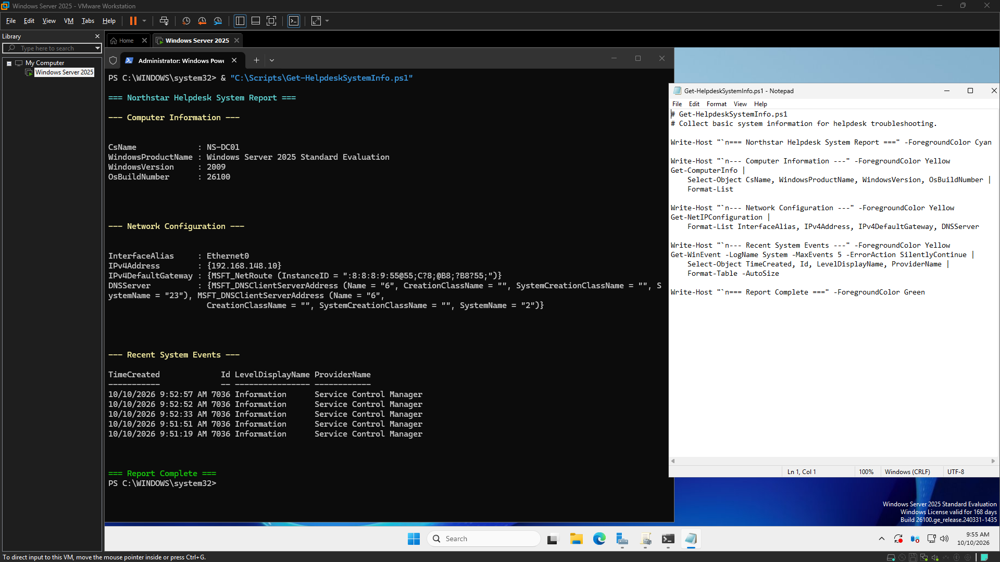
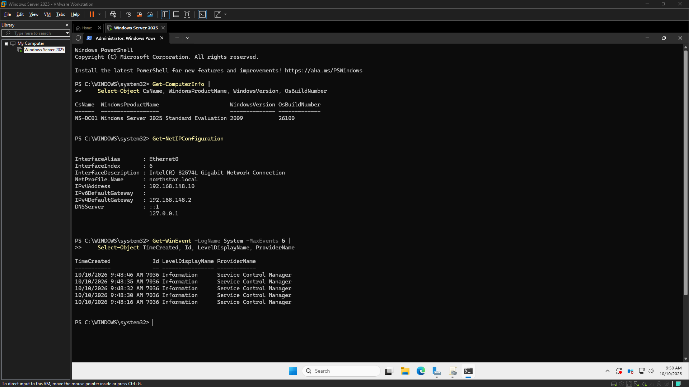
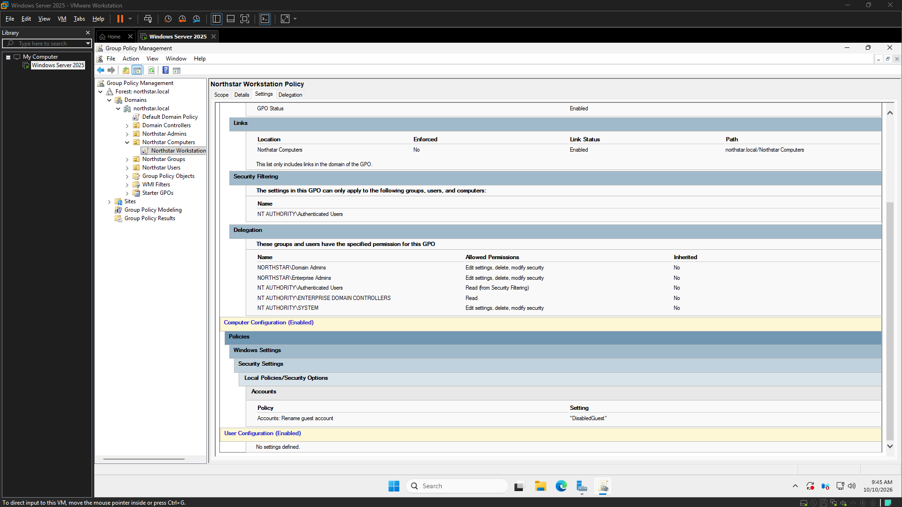

# Windows-Helpdesk-Lab

Status: In progress

## Project story
This concise summary outlines the ongoing development of the 'Windows-Helpdesk-Lab' project, a practical environment for technical skill development.

---

### 1. Project story
The `Windows-Helpdesk-Lab` project is establishing a simulated corporate IT environment designed to refine practical Windows Server administration, Group Policy management, and PowerShell-based troubleshooting skills. Current work focuses on building out foundational Active Directory and DNS services, implementing security policies through Group Policy Objects (GPOs), and developing reusable PowerShell scripts to streamline common helpdesk operations. This ongoing effort emphasizes a well-documented, verifiable, and hands-on approach to modern IT infrastructure management.

### 2. Key achievements
*   **Core Infrastructure Establishment:** Configured a Windows Server 2025 domain controller (`NS-DC01`) for the `northstar.local` domain, including static IP assignment and foundational Active Directory and DNS services.
*   **Group Policy Implementation:** Designed and deployed the 'Northstar Workstation Policy' GPO, linking it to the 'Northstar Computers' Organizational Unit (OU) and configuring a key security setting to rename the local guest account to 'DisabledGuest'.
*   **PowerShell Tooling Development:** Created and iteratively refined `Get-HelpdeskSystemInfo.ps1`, a reusable PowerShell script for standardized system information retrieval and diagnostics, integrated for efficient troubleshooting within the lab.
*   **System Health & Security Validation:** Performed comprehensive health checks of Active Directory, DNS, and critical services (`NTDS`, `Netlogon`) using `dcdiag` and PowerShell, alongside validating 'Employees Helpdesk' and 'IT-Admins' group memberships.
*   **Documentation & Repository Management:** Leveraged an automated screenshot workflow for evidence capture and established repository hygiene with a `.gitignore` file to manage local session state.

### 3. Lessons learned
*   **Interface Navigation Proficiency:** Initial friction encountered in navigating complex administrative interfaces like Group Policy Management underscored the value of deep familiarity for efficient configuration.
*   **Value of Reusable Automation:** Developing and iterating on PowerShell scripts significantly enhances the efficiency and consistency of system diagnostics and information retrieval.
*   **Scoped Execution:** Focused, time-boxed sessions with clear definitions of done prove effective in achieving measurable progress, allowing for strategic deferral of certain validations to optimize immediate goals.
*   **Multi-Layered Verification:** Emphasizing verification of configurations (e.g., GPO creation and linking) independent of their end-user application is crucial for building robust and reliable systems.

### 4. Next steps
*   Verify the application and impact of the 'Northstar Workstation Policy' GPO on domain-joined workstations.
*   Continue to expand and refine helpdesk-oriented PowerShell scripts and automation within the lab environment.
*   Further integrate and automate documentation processes for continuous project transparency.

### 5. Proof points
*   `Northstar Workstation Policy Configured`
*   `NS-DC01 Powershell System Troubleshooting`
*   `Powershell HelpDesk System Info Script & Execution`
*   `Final DNS health check`
*   `ad-structure-users-and-groups`
*   `Windows Server 2025 Installation Progress on NS-DC01`
*   `NS-DC01 static IP configured`

## What we shipped
- The project was completed with a clear objective, technical execution, and proof captured in the logs.
- The implementation and project records are documented in the repository for future context.
- The work can be reviewed quickly by anyone familiar with the project.

## Key proof moments
### Highlight: Powershell Helpdesk System Info Script Execution

This screenshot captures the live shell output or diagnostic evidence that is guiding the current troubleshooting, validation, or operational decision. It highlights the key detail the viewer should notice in this stage of the project.
### Highlight: Ns Dc01 Powershell System Troubleshooting

This screenshot captures the live shell output or diagnostic evidence that is guiding the current troubleshooting, validation, or operational decision. It highlights the key detail the viewer should notice in this stage of the project.
### Highlight: Northstar Workstation Policy Configured

This screenshot shows the current configuration or system state being reviewed as part of the active project setup, validation, or troubleshooting work. It highlights the key detail the viewer should notice in this stage of the project.

## Lessons learned
- Keep documentation close to delivery.
- Use screenshots as proof points.
- Write the project story in plain language for future reviewers.

## Next steps
- Continue from the handoff notes and current project status.
- Capture final cleanup or deployment follow-up items as they are completed.
