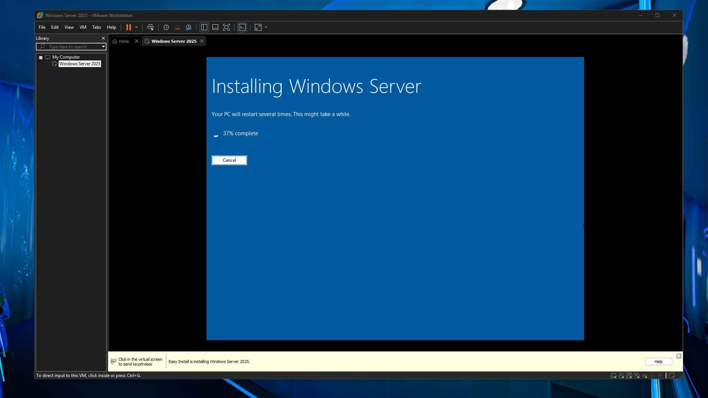
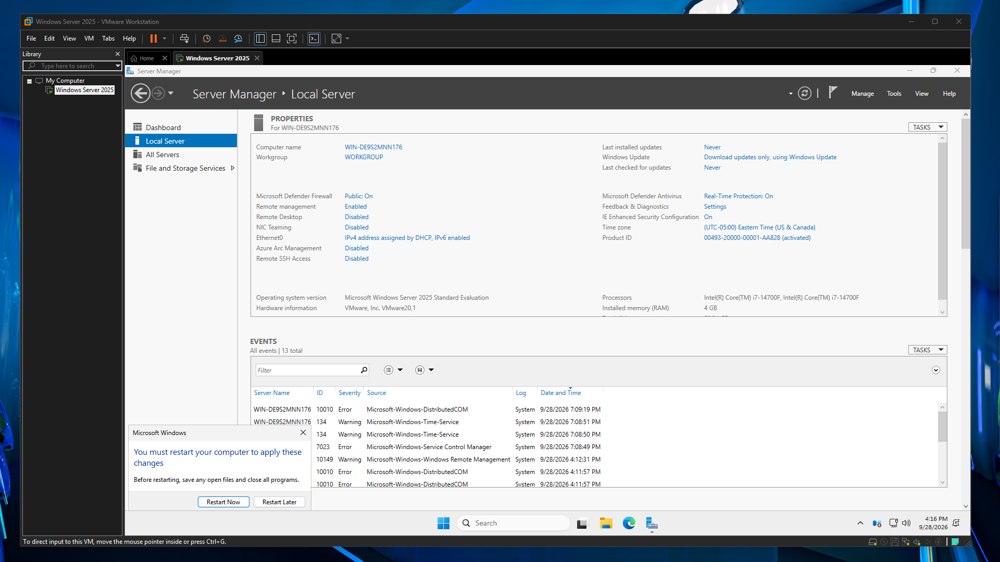
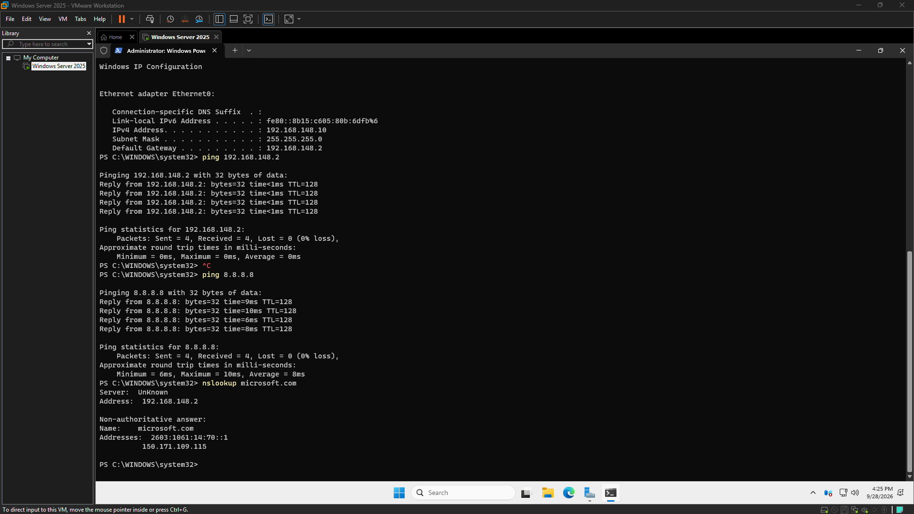
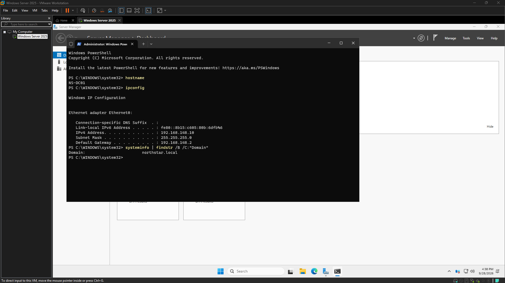
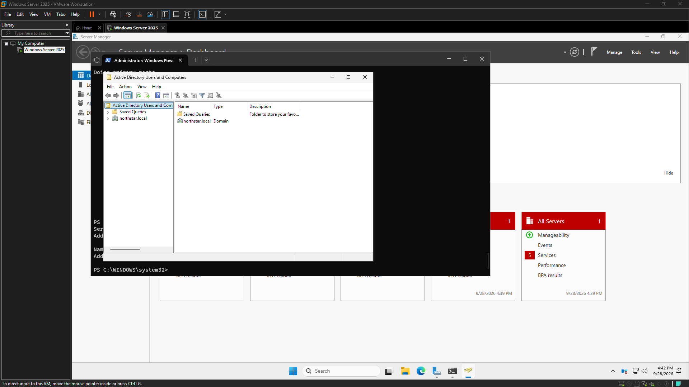
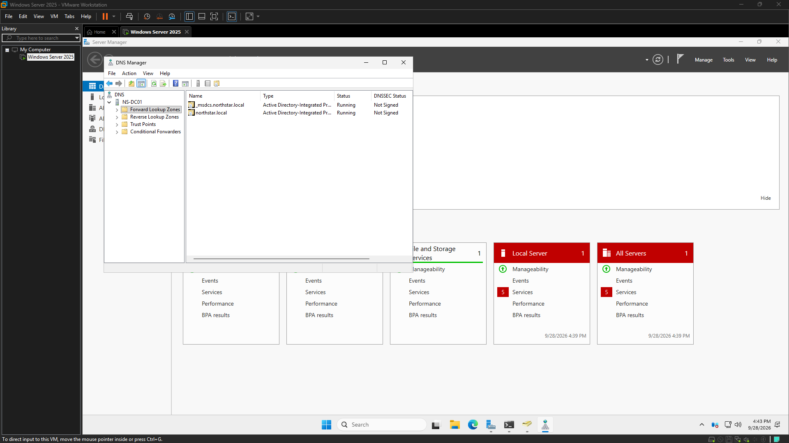
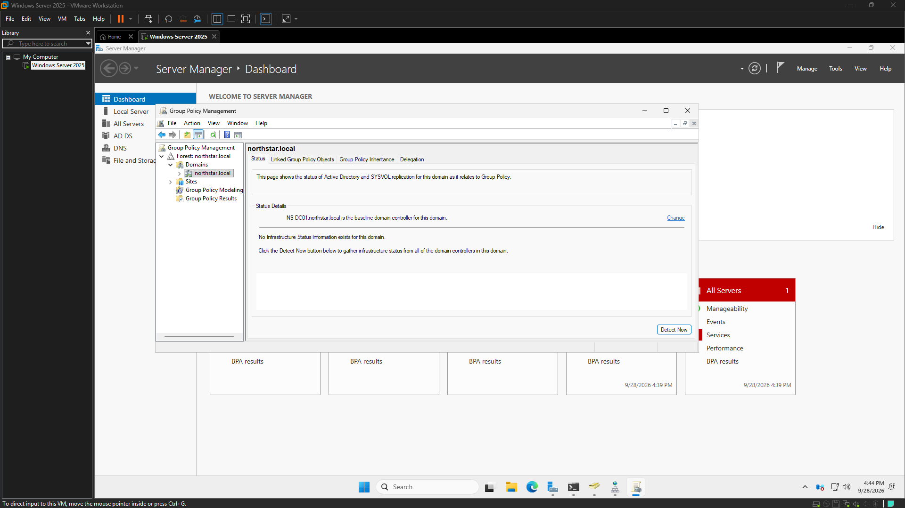
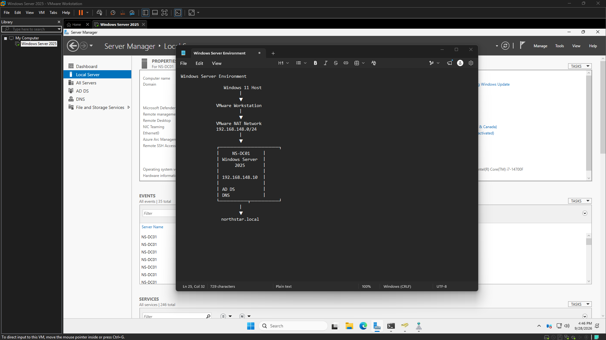
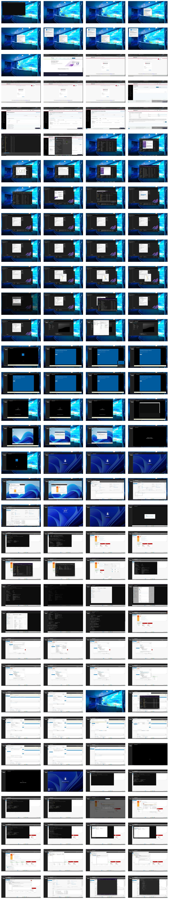

# Engineering Log – 2026-09-28

## Screenshot – Windows Server 2025 Installation Progress on NS-DC01

## Screenshot – Windows Server Manager

## Screenshot – NS-DC01 static IP configured

## Screenshot – NS-DC01 promoted to Northstar Solutions domain controller

## Screenshot – Northstar Solutions Active Directory domain controller verified

## Screenshot – Northstar Solutions DNS forward lookup zone

## Screenshot – Northstar Solutions Group Policy environment

## Screenshot – Week 1 Windows Server environment completed

## Passive activity capture – 15:38 to 16:46

Snapshots: 136 (stored as one contact sheet; no video saved)

---

## Session – 15:38 to 16:46
### Goal
Create and install the Windows Server 2022 virtual machine for the Northstar Solutions Help Desk Lab

### Definition of Done
Windows Server 2022 is installed, boots successfully, and the server is ready for initial configuration.

### Goal Achieved
✅ Yes

Summary:
The initial infrastructure for the Northstar Solutions Windows Server environment has been successfully deployed. This foundational work involved building the core domain controller and establishing essential network services, laying the groundwork for future administrative tasks and help-desk training scenarios.

Tasks Completed:
*   Deployed the initial Northstar Solutions Windows Server environment.
*   Configured NS-DC01 as the primary domain controller.
*   Established the foundational network infrastructure.
*   Installed and configured Active Directory Domain Services (AD DS).
*   Installed and configured DNS services.
*   Verified the operational status of the domain controller.

Issues Encountered:
*   Experienced extended loading times during the installation process of the Windows Server environment.

Next Steps:
*   Begin documentation of the current server configuration and network topology.
*   Prepare for the deployment of additional server roles and client machines to support future help-desk scenarios.

Notes:
This phase represents a critical step in building a robust Windows administration environment from the ground up, establishing the core infrastructure that will support all subsequent deployments and provide a realistic platform for help-desk training.

### Working Story
Building a Windows administration environment from the ground up and establishing the infrastructure foundation for future help-desk scenarios.

### Friction and AI Gaps
Installation loading times

### What the AI Missed
None

### AI Peer Review
Status: Approved
Reviewer: human
Reviewed At: 2026-09-28 16:47:43
Reviewer Notes: 

### Duration
67 minutes (Planned: 90 minutes)

### Notes

