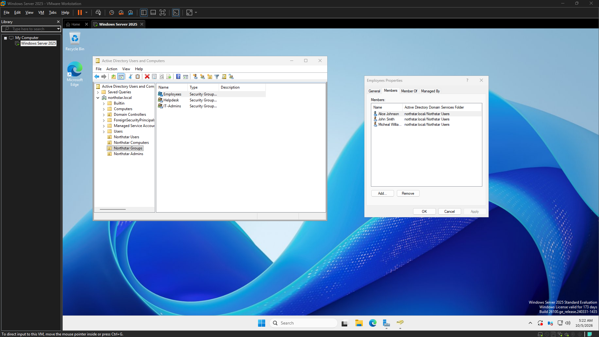
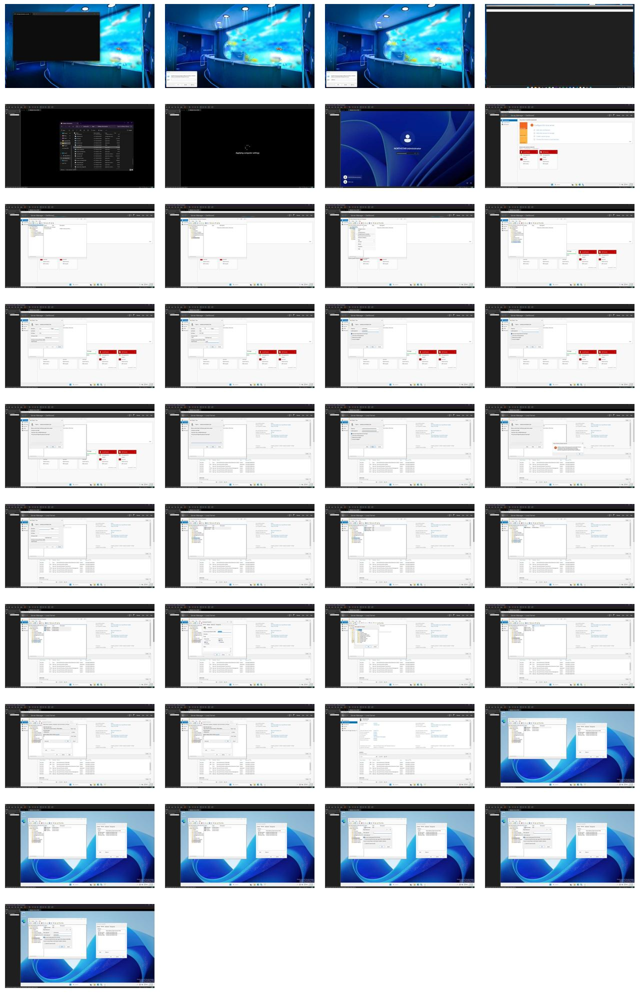

# Engineering Log – 2026-10-05

## Screenshot – ad-structure-users-and-groups

## Passive activity capture – 05:06 to 05:24

Snapshots: 37 (stored as one contact sheet; no video saved)

---

## Session – 05:06 to 05:24
### Goal
Build the initial Northstar Solutions Active Directory structure, including organizational units, users, and security groups.

### Definition of Done
OUs, test users, and security groups are created and organized in northstar.local.

### Goal Achieved
✅ Yes

Summary:
This initial phase focused on establishing a foundational Active Directory environment for Northstar Solutions, simulating a corporate setup. The primary objective was to practically demonstrate core Windows Server and Active Directory administration tasks, ensuring documented evidence of the directory structure, account management, and security group organization.

Tasks Completed:
*   Built the initial Northstar Solutions Active Directory organizational structure.
*   Created test users and security groups within the new structure.
*   Configured group membership for the created test users.
*   Practiced user password administration, including setting and resetting passwords.

Issues Encountered:
None

Next Steps:
Consolidate and present the documented evidence of the established directory structure, account management, and security group organization to fulfill the demonstration objectives.

Notes:
None

### Working Story
Demonstrate practical Windows Server and Active Directory administration in a simulated corporate environment, with documented evidence of directory structure, account management, and security group organization.

### Friction and AI Gaps
None

### What the AI Missed
None

### AI Peer Review
Status: Approved
Reviewer: human
Reviewed At: 2026-10-05 05:25:48
Reviewer Notes: 

### Duration
18 minutes (Planned: 30 minutes)

### Notes

